Cuộc thi khoa học kĩ thuật hàng năm được tổ chức để khuyến khích các học sinh tham gia nghiên cứu khoa học, tăng cường trao đổi văn hóa, giáo dục.

Tôi đã lỡ hẹn với cuộc thi từ năm lớp 11 khi thầy giáo gửi công văn về cuộc thi khi còn 4 ngày nữa là hết thời gian nộp. Đến năm lớp 12 thì cũng vậy, nhưng cũng may khi tôi có dự án đã thực hiện xong từ hè và tôi bắt đầu viết các tài liệu, hồ sơ cần thiết

Tôi dùng rất nhiều hình ảnh từ chuỗi blog "A crash course on Building RAG Systems" - Daily Dose of DS để minh họa.

# Giới thiệu về dự án của tôi
Khi tham gia trường hè MASSP, tôi đã có thêm những góc nhìn mới về AI, đặc biệt là LLM và bắt đầu tìm hiểu các kĩ thuật tối ưu hiệu năng, độ chính xác của chúng. Kĩ thuật khá phổ biến đó là sử dụng RAG (Retrieval Augmented Generation), có thể dịch tạm là: "tăng cường truy xuất thông tin cho mô hình". 
Trong dự án này, tôi sử dụng một số công nghệ như Cơ sở dữ liệu Vector (Vector Database) và hệ thống đa tác nhân (Multi Agent AI System). Tôi sẽ giải thích các khái niệm này ở phần sau.

### Vấn đề của các mô hình ngôn ngữ hiện tại
Có thể nói ngắn gọn: Những mô hình ngôn ngữ lớn được huấn luyện trên một tập dữ liệu khổng lồ (chatGPT được huấn luyện trên 45Tb dữ liệu), những dữ liệu này được lấy chủ yếu từ Internet.
Chúng có thể trả lời các câu hỏi về định nghĩa, viết luận, lập kế hoạch, làm toán,... Nhưng có một điểm yếu lớn đó là chúng sẽ gặp tình trạng thiếu thông tin để trả lời câu hỏi nếu các câu hỏi yêu cầu thông tin không có trong dữ liệu mà chúng được đào tạo.
Ví dụ: Nếu mô hình được đào tạo trên dữ liệu từ năm 2022 thì nếu hỏi những câu hỏi yêu cầu dữ liệu qua thời điểm đó, chúng sẽ không có thông tin và sẽ trả lời:  
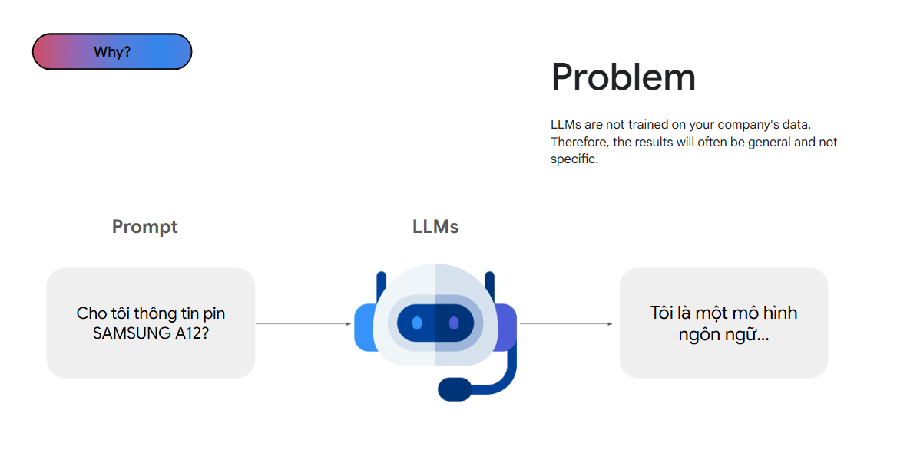

Các phiên bản trước của ChatGPT hay Gemini thường trả lời như trên nếu chúng không có thông tin hoặc không thể trả lời; hiện tại chúng đã được tích hợp các công nghệ như RAG để khắc phục điều đó.

Một vấn đề khác đó là hallucination - ảo giác, các câu văn AI tạo ra đọc rất logic, mạch lạc nhưng thông tin chúng đưa ra không chính xác hoặc không có thật; nó như chúng ta viết văn lạc đề.

### Tăng cường hiệu suốt bằng cách cải thiện đầu vào
Kĩ thuật đó gọi là RAG như giới thiệu ở trên, chúng ta hãy cùng tìm hiểu một ví dụ:
> Trong hệ mặt trời, hành tinh nào có nhiều vệ tinh tự nhiên nhất ?

Tôi nhớ rằng đã đọc ở đâu đó là Sao Mộc có 88 vệ tinh tự nhiên và nhiều nhất trong hệ Mặt Trời.
Nhưng có một số vấn đề với câu trả lời của tôi:
* Không có dẫn chứng nào về câu trả lời
* Dữ liệu có thể bị lỗi thời vì tôi đã đọc nó khoảng 6-8 năm trước

Vì vậy tôi đã lên trang của NASA để tìm và nhận được thông tin: Sao Thổ có 146 vệ tinh nhân tạo.
Và thực tế rằng, các nhà khoa học đang hàng ngày tìm kiếm được nhiều hơn nữa nên thông tin hiện tại có thể không còn chính xác trong vài năm tới.

Tôi có thêm một ví dụ nữa về ứng dụng RAG trong chatbot tư vấn điện điện thoại:
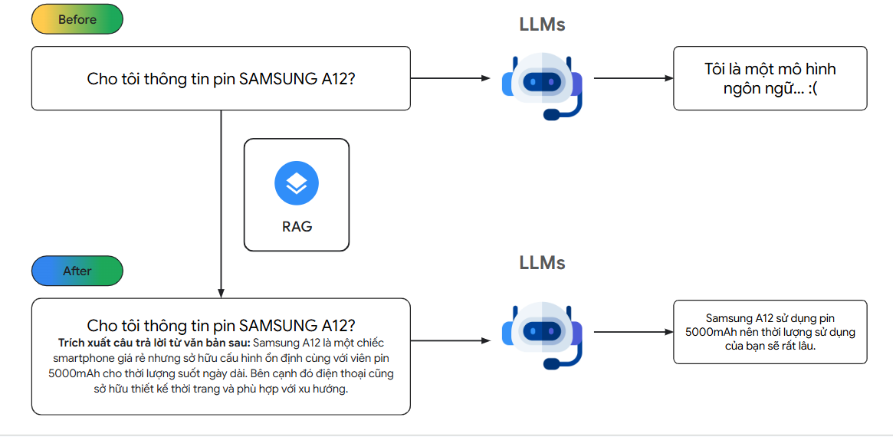

Chúng ta sẽ lấy dữ liệu về thông số của điện thoại cho LLMs để chúng đưa ra câu trả lời chính xác

Vậy, làm cách nào để LLMs có thể lấy các thông tin liên quan đến câu hỏi của chúng ta ? Các thuật toán tìm kiếm khó có thể tìm kiếm theo ngữ nghĩa như vậy, và vector database ra đời để đảm nhiệm mục đích trên.

## Vector Databases là gì ?
Các cơ sở dữ liệu truyền thống đang lưu tru dữ liệu có cấu trúc theo dạng: bảng, key-value ; và chúng hoạt động rất hiệu quả. Nhưng có khoảng 90% dữ liệu là phi cấu trúc như: ảnh, video, tài liệu, âm thanh,... Chúng ta không thể cho chúng vào cơ sở dữ liệu truyền thống được, nhưng với cơ sở dữ liệu vector, chúng ta sẽ qua bước chuyển chúng thành dạng vectors ( Vector Embeddings).
Mỗi điểm dữ liệu, dù là tài liệu, PDF, hình ảnh, video đều được chuyển thành dạng vector bằng cách sử dụng các kĩ thuật học may (Machine Learning).
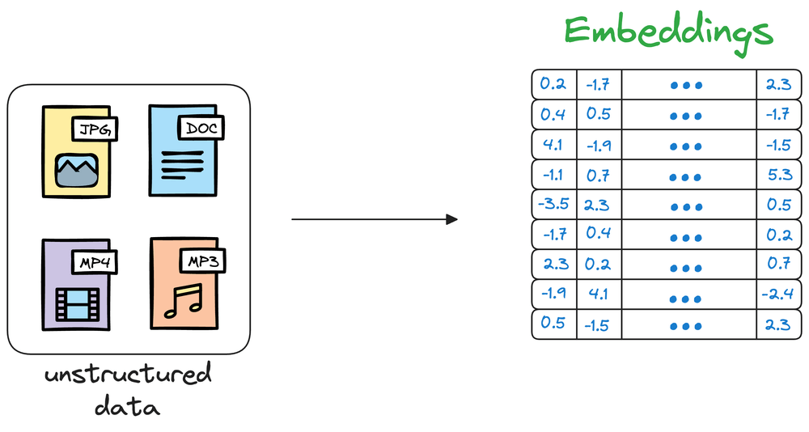
Khi chuyển các văn bản thành vector, chúng ta sử dụng kĩ thuật nhúng văn bản (word embeddings); tất cả các văn bản đều sẽ chuyển thành cùng mọt không gian vector (có thể là 768 chiều hoặc 1536 chiều) mà vẫn giữ được cái ngữ nghĩa của chúng
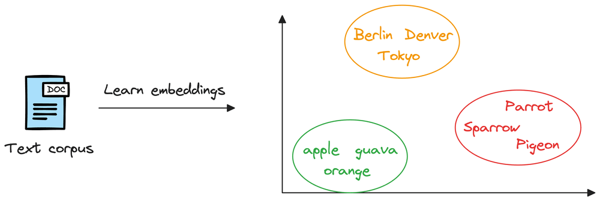

Ví dụ: vector của các loại trái cây sẽ ở gần nhau, của các tên thành phố sẽ ở gần trong cụm của chúng

Điều đó cho thấy răng những vector nhúng này đã học được cái ngữ nghĩa mà từ chúng biểu diễn

Một khi đã luư trữ trong cơ sở dữ liệu vector, chúng ta có thể tìm những vector có đặc điểm giống với cái chúng ta cần tìm
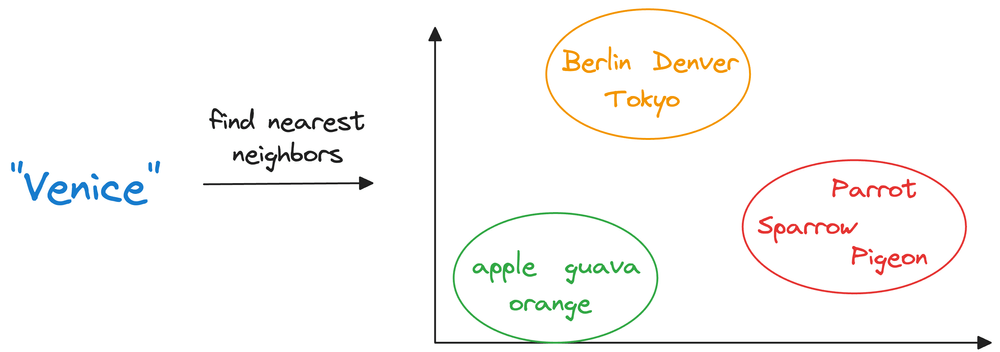
Tóm lại: việc mã hóa các dữ liệu phi cấu trúc thành dạng vector giúp chúng ta có thể chạy rất nhiều phép toán như: 
- TÌm kiếm tương đồng
- Phân cụm
- Phân loại

Ví dụ: Khi chúng ta sử dụng shopee, nếu ấn vào 1 sản phẩm hoặc tìm kiếm tên thì sau đó sẽ được gợi ý các sản phẩm có đặc điểm tương tự; trong hầu hêt các ứng dụng, chúng ta đang sử dụng vector database để gợi ý.

## Ứng dụng của vector database cho RAG
Tiếp theo chúng ta sẽ tim hiểu các mà LLMs sử dụng vector database
Đầu tiên, chúng ta cần hiểu rằng, mô hình ngôn ngữ lớn được huấn luyện trên một lương lớn dữ liệu (hàng Tb) sau đó sẽ được triển khai thực tế:
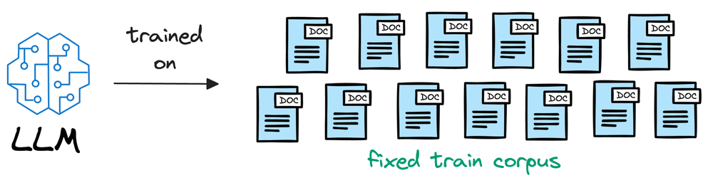
Ví dụ: nếu mô hình được huấn luyện băng dữ liệu trước tháng 12 năm 2022, và chúng ta hỏi các câu hỏi cần dữ liệu sau thời điểm dó, chúng sẽ gặp khó!!!
(chúng sẽ không biết Messi vô địch WC )
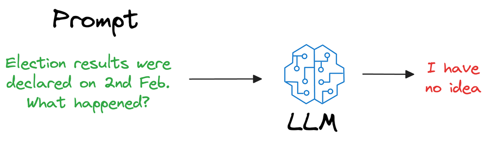
Chúng ta có thể huấn luyện lại mô hình mỗi ngày với dữ liệu mới để khắc phục điều này nhưng giá thành là một vấn đề lớn, và có thể mất vài tuần để hoàn thành.

Thay vào đó, sẽ tốt hơn nếu chúng ta cho LLMs học cấu trúc tổng thể của ngôn ngữ, và cách tạo ra văn bản
![[Pasted image 20241130150424.png]]
Chúng được huấn luyện trên lượng lớn dữ liệu, và có khả năng hiểu và tạo sinh. Nên chúng ta tìm cách cho chúng thông tin mới nhất mà không cần đào tạo lại thì là cách rất tuyệt vời
Chúng ta có thể đính kèm thông tin trong câu hỏi:
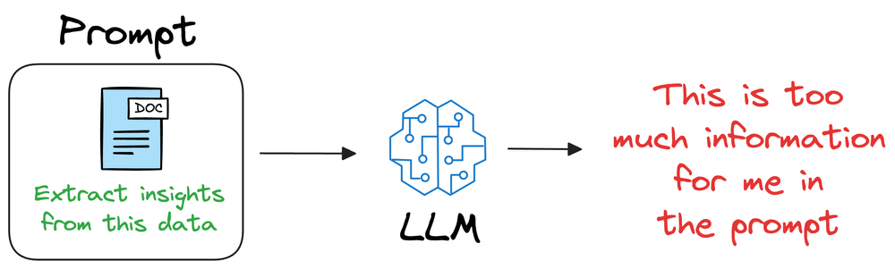
Nhưng các mô hình có giới hạn về số lượng từ có thể xử lí (context window), lượng thông tin có thể bị giới hạn.

Chúng ta sử dụng vector database để giải quyết vấn đề này

### Agent và Multi Agent
Một tác nhân là một hệ thống sử dụng mô hình ngôn ngữ lớn (LLM) để quyết định luồng hoạt động của ứng dụng. Khi phát triển hệ thống, chúng ta có thể gặp phải những vấn đề phức tạp hơn, khó quản lí và mở rộng. Ví dụ:
-	Tác nhân sử dụng nhiều công cụ và đưa ra các quyết định kém về công cụ nào sẽ sử dụng bối cảnh (context) tiếp theo
-	Rất phức tạp để tác nhân duy nhất có thể theo dõi các quá trình
-	Cần nhiều hệ thống chuyên biệt cho nhiều tác vụ như (lập kế hoạch, nghiên cứu, giải toán, viết luận,..)

Để giải quyết những vấn đề này, chúng ta có thể cân nhắc việc chia ứng dụng thành nhiều tác nhân độc lập, nhỏ hơn và kết hợp với chúng thành một hệ thống đa tác nhân. Các tác nhân nhỏ độc lập này có thể đơn giản là gọi hàm, hoặc phức tác như tác nhân phản ứng (react agent)
Một số lợi ích của sử dụng hệ thống đa tác nhân(multi-agent system):
-	Mô đun hóa: các tác nhân riêng biệt sẽ giúp phát triển, thử nghiệm và bảo trì các hệ thống tác nhân dễ dàng hơn.
-	Chuyên môn hóa: các tác nhân chuyên biệt sẽ tập trung vào một lĩnh vực cụ thể, giúp tăng hiệu suất tổng thể của hệ thống

### Demo Ứng Dụng
Hướng Dẫn Sử Dụng Phần Mềm RAGapp
Để chạy phần mềm RAGapp, làm theo các bước dưới đây:
1. Khởi Chạy Docker Container
Chạy lệnh sau trong terminal để khởi động một Docker container với hình ảnh của RAGapp:
`docker run -p 8000:8000 thanhkt/rag`
2. Truy Cập Giao Diện Quản Trị
Sau khi container được khởi chạy, truy cập Giao diện Quản trị (Admin UI) tại địa chỉ:

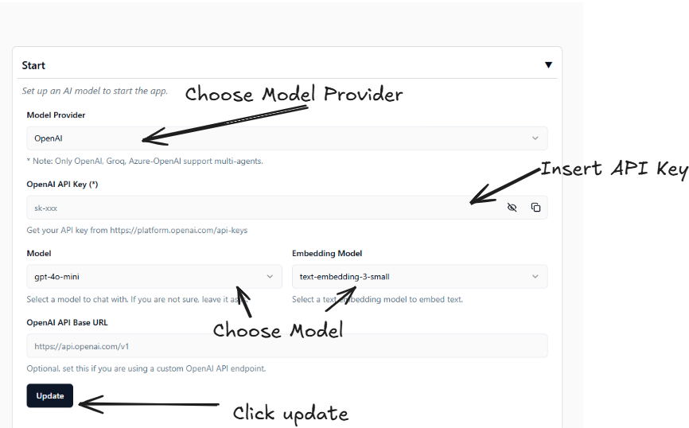

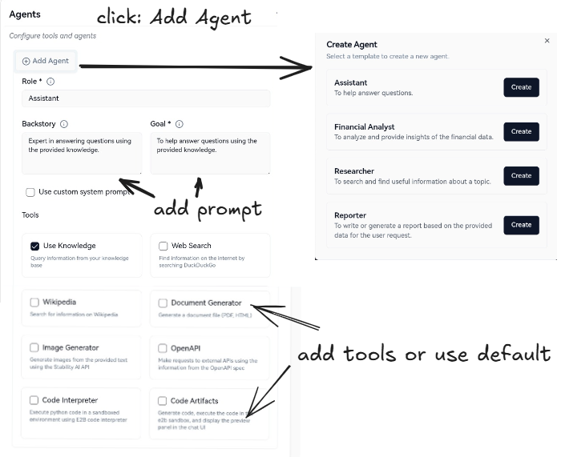

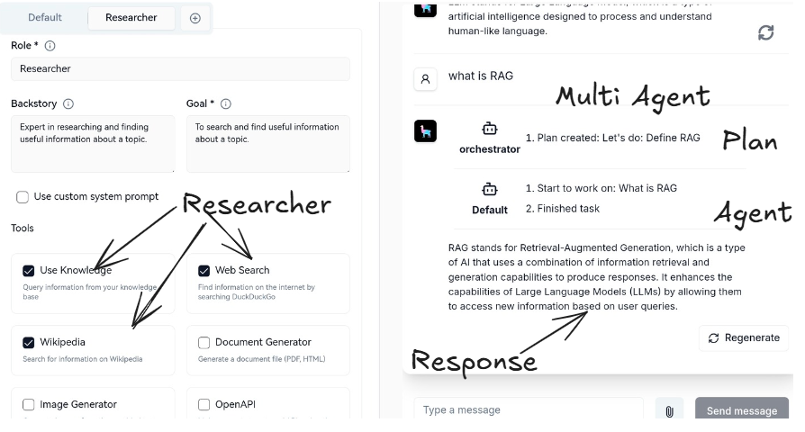

