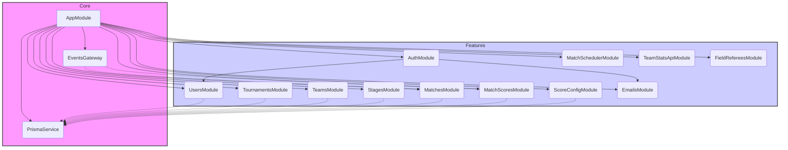
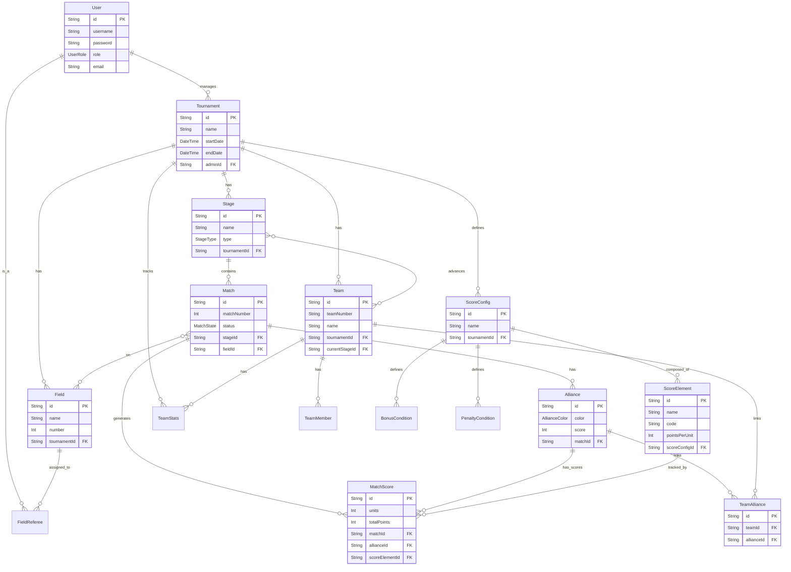

Here is a technical portfolio for the RMS Backend project, based on the provided files.

-----

## **Project Technical Portfolio: RMS Backend**

### 1\. Project Overview

The RMS (Robotics Management System) Backend is a comprehensive, NestJS-based application designed to manage robotics tournaments. It provides a complete solution for the tournament lifecycle, featuring user management with role-based access, automated match scheduling (including Swiss and Playoff stages), multi-field support, and real-time scoring via WebSockets.

The system is built with a modern technology stack, centered around Node.js, NestJS, and Prisma, and is designed for scalability and maintainability.

### 2\. Core Features

  * **User Management:** Role-based access control (RBAC) with 6 distinct user roles (e.g., `ADMIN`, `HEAD_REFEREE`, `TEAM_LEADER`).
  * **Tournament Management:** Full CRUD operations for tournaments, including configuration of stages, teams, and scoring.
  * **Match Scheduling:** Automated scheduling with support for multiple strategies, including Swiss, Playoff, and Final stages.
  * **Real-time Scoring:** Live score updates broadcast to connected clients (like field displays) using Socket.IO.
  * **Multi-field Support:** Ability to manage and assign matches and referees to multiple concurrent fields within a tournament.
  * **Dynamic Score Configuration:** A flexible system allowing tournament admins to define scoring elements, bonus conditions, and penalties.
  * **Email Notifications:** Integrated email service for functions like user account activation.

### 3\. Technology Stack

| Category | Technology | Source(s) |
| :--- | :--- | :--- |
| **Framework** | NestJS 11.0.1 | |
| **Language** | TypeScript | |
| **Runtime** | Node.js 18+ | |
| **Database** | PostgreSQL 12+ | |
| **ORM** | Prisma 6.6.0 | |
| **Authentication** | JWT with HTTP-only cookies, Passport, bcrypt | |
| **Real-time** | Socket.IO (via `@nestjs/websockets`) | |
| **API & Docs** | REST, Swagger (OpenAPI) | |
| **Validation** | Zod (via `nestjs-zod`), `class-validator` | |
| **Emailing** | Nodemailer (via `@nestjs-modules/mailer`) | |
| **Deployment** | Docker, PM2 | |

-----

### 4\. System Architecture

The application is built on a modular, service-oriented architecture using NestJS. The `AppModule` imports various feature modules, each encapsulating a specific domain of the application. This promotes separation of concerns and maintainability.

**Core Modules:**

  * **`AuthModule`**: Handles user registration, login, and JWT-based session management.
  * **`UsersModule`**: Manages user profiles and roles.
  * **`TournamentsModule`**: Manages the core tournament lifecycle.
  * **`TeamsModule`**: Manages team registration and details.
  * **`StagesModule`**: Manages tournament stages (e.g., Swiss, Playoff).
  * **`MatchesModule`**: Manages individual matches, scheduling, and status.
  * **`MatchSchedulerModule`**: Contains the logic for automated match generation.
  * **`ScoreConfigModule`**: Manages the dynamic scoring rules for a tournament.
  * **`MatchScoresModule`**: Handles the submission and calculation of scores for matches.
  * **`EventsGateway` (WebSocket)**: A central provider for real-time communication, broadcasting updates like score changes and match state transitions.
  * **`PrismaService`**: A shared provider that encapsulates the Prisma Client, injected into other services for database access.

#### **Module Dependency Diagram**

-----

### 5\. Database & Data Model

The data model is managed by Prisma and defined in the `prisma/schema.prisma` file. The schema is centered around the `Tournament` model, which acts as a root for most other data, including `Stage`s, `Team`s, `Field`s, and `ScoreConfig`s.

#### **Key Model ERD**

This diagram illustrates the core relationships between the main entities in the system.

#### **Key Model Descriptions**

  * **User**: Represents an individual who can log in. Has a `role` (e.g., `ADMIN`, `HEAD_REFEREE`) that determines permissions.
  * **Tournament**: The top-level entity for an event. It has a start/end date and is associated with an `ADMIN` user. It contains `Stage`s, `Team`s, `Field`s, and `ScoreConfig`s.
  * **Stage**: A phase of a tournament, such as `SWISS` or `PLAYOFF`. It contains a set of `Match`es.
  * **Team**: A participant in a `Tournament`. Can have `TeamMember`s and progresses through `Stage`s.
  * **Match**: An individual game between `Alliance`s. It has a `status` (e.g., `PENDING`, `IN_PROGRESS`, `COMPLETED`) and is scheduled at a specific time on a `Field`.
  * **Alliance**: One of the two sides (`RED` or `BLUE`) in a `Match`. It is composed of one or more teams (via `TeamAlliance`).
  * **ScoreConfig**: Defines the scoring rules for a tournament. It is composed of `ScoreElement`s (e.g., "Cubes in Goal", 5 points), `BonusCondition`s, and `PenaltyCondition`s.
  * **MatchScore**: A record of a specific `ScoreElement` for a specific `Alliance` in a specific `Match`.
  * **Field**: A physical location where matches are played. `FieldReferee`s can be assigned to it.
  * **FieldDisplay**: Represents the screen associated with a `Field`, showing the `currentMatch` or `CUSTOM_MESSAGE`.

-----

### 6\. API & Real-Time Communication

#### **Key API Endpoints**

  * **Authentication**: `POST /api/auth/register`, `POST /api/auth/login`
  * **Core Resources**: Full CRUD on `/api/users`, `/api/tournaments`, `/api/teams`, `/api/stages`, `/api/matches`
  * **Team Import**: `POST /api/teams/import`
  * **Stage Advancement**: `POST /api/stages/:id/advance-teams`
  * **Scheduling**: `POST /api/match-scheduler/generate`, `GET /api/match-scheduler/schedule/:stageId`
  * **Scoring & Rankings**: `GET /api/match-scores/leaderboard`
  * **Referee Assignment**: `POST /api/field-referees/assign`

#### **WebSocket Events**

The `EventsGateway` handles real-time communication.

  * **Client Emits**:
      * `join-field-display`: A client (e.g., a field monitor) joins a room to receive updates for a specific field.
      * `update-score`: A referee client sends a partial score update.
      * `persist-scores`: A referee client submits the final scores for a match.
  * **Server Emits**:
      * `score-update`: Broadcasts updated (non-final) scores to all clients viewing a match.
      * `match-state-change`: Informs clients about changes in a match's status (e.g., `IN_PROGRESS` to `COMPLETED`).
      * `field-display-update`: Sends comprehensive state updates to field display clients.

### 7\. Development & Operations

  * **Development**: The `npm run start:dev` script uses Webpack HMR for a hot-reload development experience.
  * **Testing**: The project includes scripts for unit tests (`npm run test`), e2e tests (`npm run test:e2e`), and test coverage (`npm run test:cov`).
  * **Database Migrations**: Database schema changes are managed by Prisma Migrate (`npx prisma migrate dev`).
  * **Deployment**: The application is designed for production deployment using either Docker (via `docker-compose`) or a process manager like PM2.
  * **Admin Initialization**: On application startup, the `AppModule` ensures a default admin account exists by calling `authService.createDefaultAdmin()`.