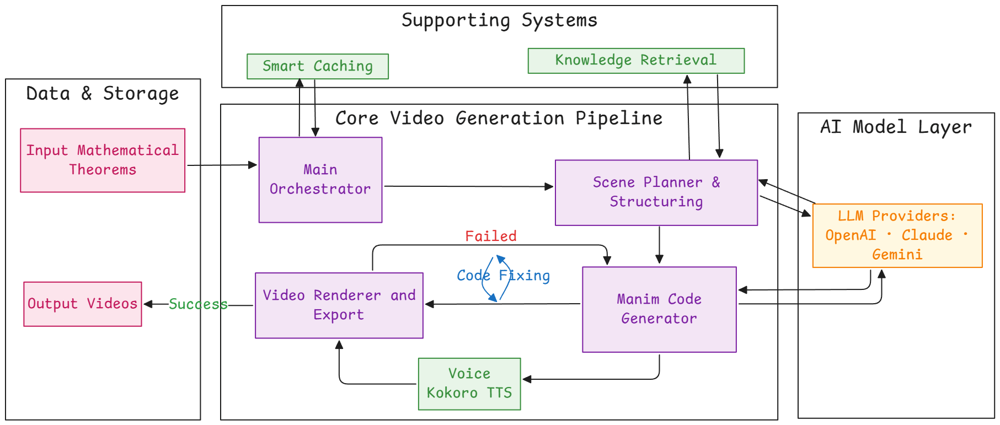
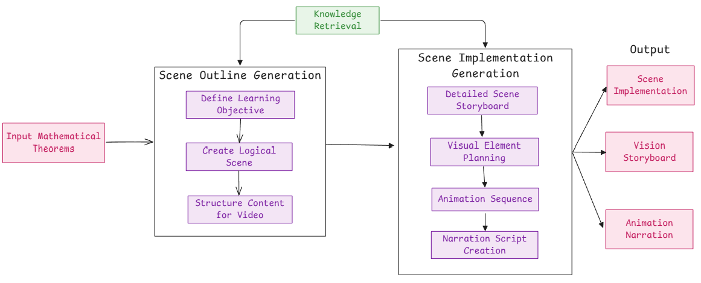
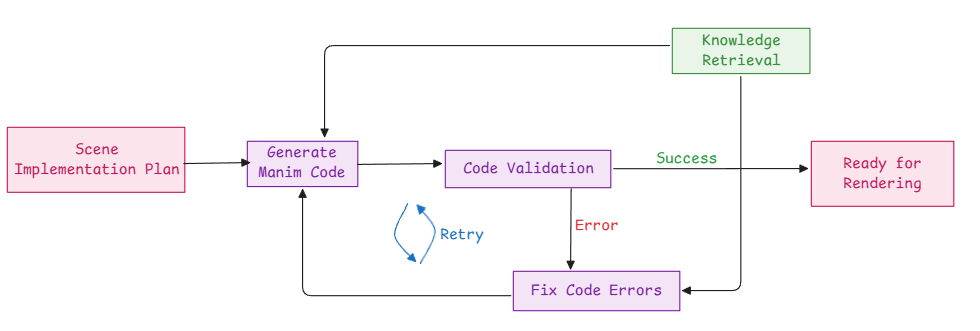

# StemFun: Generative STEM Video Powered by Manim

## The Problem: Beyond Rote Memorization

In modern STEM education, students often get stuck in a loop of "rote memorization" (học vẹt). They can find videos that show how to solve a problem, but rarely ones that explain why a specific formula or concept is used.

Current AI video generation tools (like Fliki or Revid) are designed for marketing and basic content. They fail at STEM education because they:

- **Lack Precision**: They cannot accurately visualize complex mathematical, physical, or chemical concepts
- **Suffer from "Element Overlap"**: Diffusion models often create messy, overlapping, or nonsensical graphics
- **Lack Pedagogical Depth**: They cannot explain the "first-principles" reasoning behind a solution

This leaves a major gap: a need for an AI tool that can act as a true "tutor," building deep, intuitive understanding through accurate and dynamic visuals.

## The Solution: "AI Video Tutor" with Manim

StemFun (also known as the "AI Video Tutor for STEM") is a platform that generates high-precision, educational videos.

Instead of relying on diffusion models, our core is built on Manim, the mathematical animation library famously used by 3Blue1Brown. This allows us to render crisp, accurate, and non-overlapping vector graphics, code, and formulas.

We combine Manim's precision with a sophisticated Large Language Model (LLM) orchestration system to not only show the answer but explain the reasoning from the ground up.

## Core Features

### Conceptual Topic Explainer
Takes a STEM concept (e.g., "Gradient Descent," "Eigenvalues") and generates a full video explanation with visuals and a voiceover.

### Step-by-Step Exercise Solver
The user provides a STEM problem (e.g., a physics problem, a probability puzzle). The AI generates a video that walks through the solution step-by-step, visualizing each stage.

### Dynamic Coding Tutorials
Generates videos that explain an algorithm, show the code, and simulate its execution, visualizing how data structures change in real-time.

### AI-Powered Online Editor
A web-based interface to edit the AI-generated videos, allowing for fine-tuning and customization.

## Innovation & Competitive Advantage

| Feature | Standard AI Video Tools (Fliki, Revid) | StemFun (AI Video Tutor) |
|---------|----------------------------------------|--------------------------|
| **Visualization** | Diffusion-based, often inaccurate, "element overlap" | Manim-based. Mathematically precise, clean, and accurate |
| **Explanation** | "Text-to-Video" - only reads what's provided | "Concept-to-Explanation." LLM + RAG explains the "why" and "how" |
| **Accuracy** | Prone to LLM "hallucination" | RAG & Tool-Calling. Verifies facts with a knowledge base and uses tools (e.g., code interpreters, calculators) for 100% accurate results |
| **Content** | Basic marketing or "infotainment" | Deeply Pedagogical. Designed specifically for complex STEM topics |

## System Architecture

The system is a robust, asynchronous pipeline designed to handle complex, multi-step generation tasks.

### Step-by-Step Generation Workflow
Overall architecture

#### Request & Queueing (Frontend & Backend)
- A user submits a request (e.g., "Explain Binary Search") via the Next.js frontend
- The FastAPI backend receives the request, validates it, and saves the job details to a PostgreSQL database
- The job is then pushed onto a Redis queue, managed by Celery, for asynchronous processing

#### Planning & Scripting (Orchestrator)
- A Celery worker picks up the job from the queue
- This triggers the core LangChain / LangGraph orchestrator (the "Main Orchestrator")
- The orchestrator uses an LLM (e.g., GPT-4o, Claude 3, Gemini 2.5) to act as a "Scene Planner"

The Scene Planner:
- **Retrieves Knowledge (RAG)**: Queries a ChromaDB or PineCone Vector DB (using the Gemma embedding model) to fetch accurate scientific facts and relevant Manim code examples
- **Calls Tools**: Uses tools like a web-search agent (for real-time info) or a "MCP Server" (computation engine) to get verifiable data
- **Generates a Plan**: Creates a high-level conceptual script and a structured scene-by-scene storyboard

#### Scene Generation & Manim Code (Core AI)
- The "Scene Planner" passes the storyboard to the "Manim Code Generator"
- This is a specialized agent (likely a LangGraph) that iterates through each scene and writes the actual Python code for Manim required to animate that scene
- It uses the RAG-retrieved code snippets as a reference to write effective and error-free Manim code

#### Error Handling & Refinement (Self-Correction Loop)
- The generated Manim code is sent to a "Code Validation" service
- **If Successful**: The code is approved and sent to the render farm
- **If Failed (Error)**: The code and the error message (e.g., ManimException) are sent to a "Code Fixing" agent

#### Rendering & Assembly (GPU Cluster)
- The validated Manim Python scripts are sent to a GPU render cluster (e.g., AWS EC2, GCP Compute) running OpenGL
- Manim renders the scenes into video (or image) files
- Kokoro TTS (or another service) generates the voiceover
- FFmpeg and sox are used to combine the video scenes, add the audio, and encode the final .mp4 file

## Technology Stack

### Frontend
- **Framework**: Next.js
- **Styling**: TailwindCSS

### Backend
- **Framework**: Python, FastAPI
- **Database**: PostgreSQL (for job/user data), Redis (for caching & queue)
- **Task Queue**: Celery

### AI & Orchestration
- **Framework**: LangChain / LangGraph
- **LLM Providers**: OpenAI (GPT-4o), Anthropic (Claude 4), Google (Gemini 2.5)
- **Vector DB / RAG**: ChromaDB, PineCone
- **Embedding Model**: Gemma - 300M (for code retrieval task)
- **Tools**: Docling, Web Search, MCP Server (Mathematical Computation Platform)

### Video & Rendering
- **Core Library**: Manim
- **Rendering Engine**: OpenGL
- **Audio/Video**: FFmpeg, sox
- **Voice**: Kokoro TTS

### DevOps & Infrastructure
- **Containerization**: Docker
- **Cloud**: AWS (S3, EC2, RDS) or GCP
- **Version Control**: Git

## Target Audience & Impact

### Students (High School & University)
To gain a deep, intuitive understanding of complex STEM topics.

### Teachers & Educators
To create engaging, high-quality, and customized visual aids for their courses without needing any animation experience.

### Researchers
To visualize and explain their findings and complex models.

### Educational Platforms (EdTech)
To integrate as an API to auto-generate video explanations for their existing content libraries.