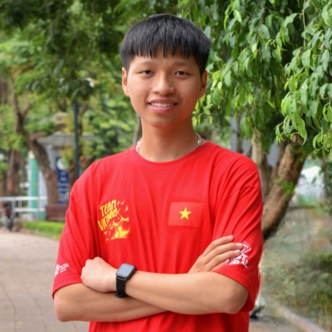

Hello! I’m Thanh. I am a passionate high school student with interest in STEM, robotics, and programming. 

Recently, I had the privilege of competing at [FIRST Global Challenge 2023](https://first.global/about/) in Singapore, where I won the Gold Medal for Finalist Winning Alliance. I participated in [Math and Science Summer Program](https://www.masspvn.org/en) and learned about Machine Learning. Moreover, my team has researched a paper about "Enhance Long Medical Document Summarize with LSG Attention".

My technical journey includes skills in programming languages like Python, JavaScript, and C++, alongside hands-on experience in web development and machine learning.

Driven by a desire to inspire and support my peers, I founded the Ung Hoa B Robotics and STEAM Club, where I lead various initiatives to mentor students interested in these fields. Through this club, I have had the chance to dive deep into robot programming, data science, and artificial intelligence, continuously pushing myself to expand my knowledge and contribute meaningfully to my community.

I designed and crafted this based on [my personal blog](https://khanhthanh.dev).

  

## Tech Stack

- Programming Languages: Python, JavaScript, C++
- Machine Learning: PyTorch, Keras, scikit-learn, HuggingFace, 
- Web Development: HTML, CSS, JavaScript, Node.js, Nextjs, Supabase, Astro
- Data Processing: Pandas, Numpy, SQL, NLTK, HuggingFace
- DevOps: Docker, GitHub
## Features

I’m currently focused on studying machine learning models and building Vietnamese datasets to facilitate NLP projects. I am also exploring the development of AI applications and web platforms integrated with AI capabilities, with the aim of creating impactful, user-centered technology solutions.
My work can be found in [HunggingFace](https://huggingface.co/thanhkt)

## Contact
If you’d like to connect, collaborate, or simply chat about STEM, robotics, or AI, feel free to reach out!

- Email: thanhkt27507@gmail.com
- LinkedIn: [khanhthanhdev](https://www.linkedin.com/in/khanhthanhdev/)
- GitHub: [khanhthanhdev](https://www.github.com/khanhthanhdev/)
